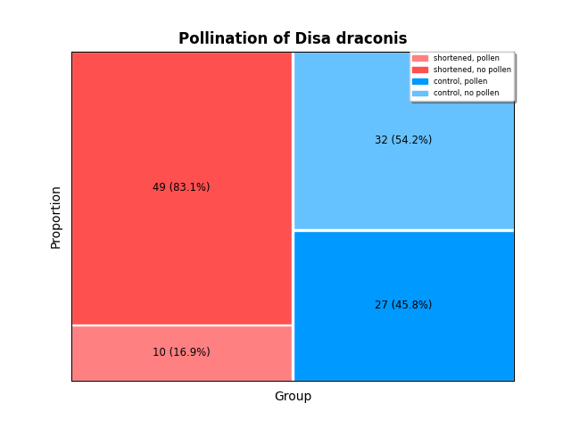
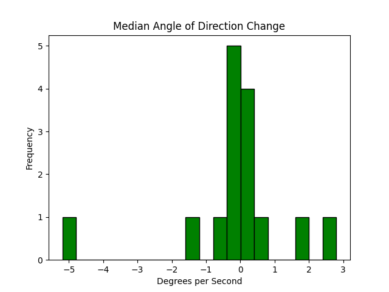
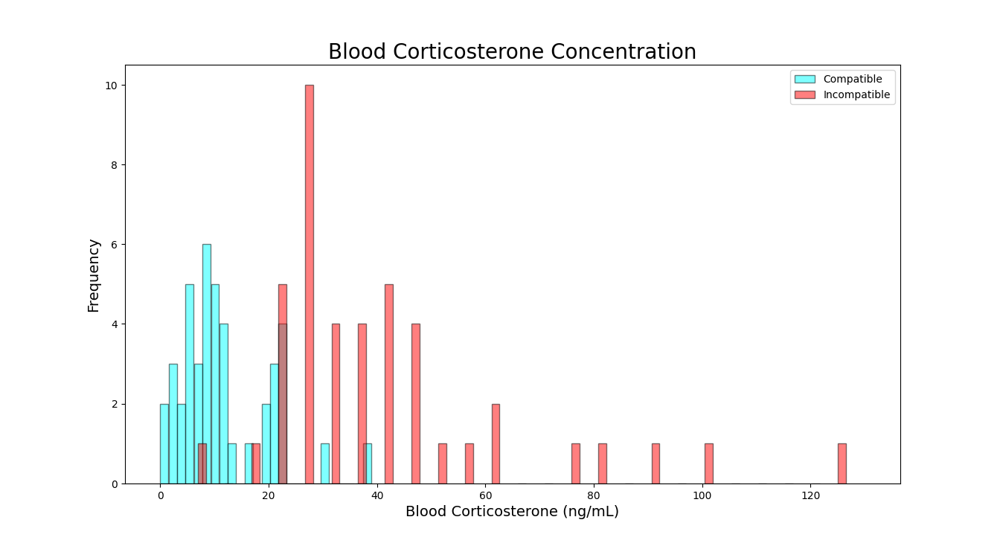

<h1>BE-GY 6473 Applied Mathematics and Statistics for Biomedical Engineers</h1>

Centralized repository for the visualization homework throughout this course @NYU Tandon.
 

<h3><b>Lab #1</b></h3>
</img>
</img>

<h3><b>Lab #2</b></h3>
</img>
</img>

<h3><b>Lab #5</b></h3>
</img>

<h3><b>Lab #6</b></h3>
</img>

<h3><b>Lab #8</b></h3>
</img>
